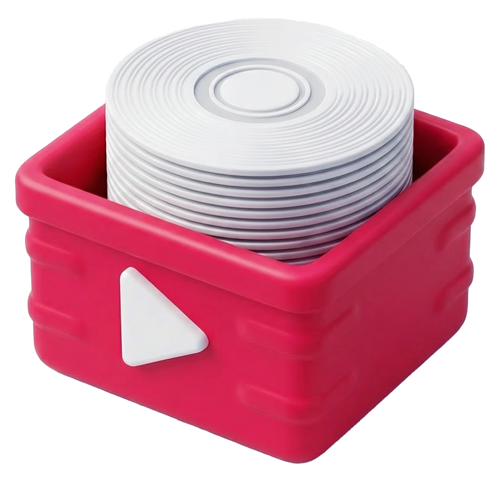

<p align="center">
  
</p>

<h1 align="center">TuneCrate</h1>

<p align="center">
  Search, preview, and download music tracks — inside DaVinci Resolve or as a standalone app.
</p>

---

## What is TuneCrate?

TuneCrate is a music discovery plugin for **DaVinci Resolve** (and a standalone Electron app). It connects to YouTube Music so you can find tracks, preview them, and download high-quality audio — all without leaving your editing workflow.

**Key features:**

- Search the YouTube Music catalog or browse curated artists
- Preview tracks in-app before committing to a download
- Download as **MP3 (320 kbps)** or **WAV (24-bit 48 kHz)**
- Import tracks directly into the Resolve **Media Pool** or **Timeline**
- Organize downloads into custom playlists
- Auto-sync download folders to your current Resolve project

## Two Modes

TuneCrate runs in one of two modes, controlled by `app-profile.json`:

### Open Mode

Full access to the YouTube Music catalog. Search for anything, browse trending sections, discover new releases.

```json
{ "mode": "open" }
```

### Curated Mode

Restricts the catalog to a predefined artist list (`data/curated-artists.json`). Search results and home sections only show approved artists. Useful when you need a controlled library.

```json
{ "mode": "curated", "artistList": "curated-artists.json", "filterFemale": true }
```

Set `filterFemale` to `false` to include all artists in the curated list.

### Switching Modes

Either edit `app-profile.json` directly, or use the npm shortcuts:

```bash
npm run start:open       # launch in open mode
npm run start:curated    # launch in curated mode
```

## Installation

### For non-technical users

Download the installer for your computer from the Releases page:

- **macOS:** double-click the `.pkg`; keep **Curated Catalog** selected, or deselect it for the full open catalog
- **Windows:** double-click the `.exe` file

Follow the prompts, restart DaVinci Resolve, then open **Workspace → Workflow Integrations → TuneCrate**. The installer includes the app runtime, so Node.js and command-line setup are not required.

> TuneCrate requires **DaVinci Resolve Studio**. Workflow Integrations are not available in the free edition.

### Developer setup

Requires Node.js 18 or newer.

### Setup

```bash
git clone https://github.com/davidyosefdayan/TuneCrate.git
cd TuneCrate
npm install
```

`npm install` automatically downloads the required **yt-dlp** and **ffmpeg** binaries.

### Run Standalone

```bash
npm start
```

### Install into DaVinci Resolve

```bash
sudo npm run install-plugin
```

This copies the plugin to:

| Platform | Path |
|----------|------|
| macOS | `/Library/Application Support/Blackmagic Design/DaVinci Resolve/Workflow Integration Plugins/TuneCrate` |
| Windows | `%PROGRAMDATA%\Blackmagic Design\DaVinci Resolve\Support\Workflow Integration Plugins\TuneCrate` |

Then:

1. Restart DaVinci Resolve
2. Go to **Workspace → Workflow Integrations → TuneCrate**

## Usage

### Searching & Browsing

- Use the **search bar** to find songs, albums, artists, or playlists
- Browse the **home page** for quick picks, featured albums, and new releases
- Click into any artist to see their top songs, albums, and singles

### Downloading

- Click the download button on any track
- Choose between MP3 and WAV in **Settings**
- Downloads are saved to `~/Music/TuneCrate` by default (configurable in Settings)
- Enable **Sync to Project** to auto-organize downloads into folders matching your Resolve project name

### Resolve Integration

When running inside DaVinci Resolve:

- **Import to Media Pool** — adds the downloaded file to your current project
- **Add to Timeline** — appends the track as an audio-only clip on the timeline
- The connection status indicator shows whether Resolve is linked

### Playlists

- Create custom playlists to organize your favorite tracks
- Add tracks from search results or the download history
- Playlists persist across sessions

## Building Releases

```bash
npm run build         # build for current platform
npm run build:all     # build for macOS (ARM64 + x64) and Windows (x64)
```

Builds are output as native `.pkg` (macOS) or `.exe` (Windows) installers ready for distribution. Tagged releases (`v*`) trigger the GitHub Actions pipeline to build and publish automatically.

For a public macOS release, set `INSTALLER_SIGNING_IDENTITY` to your **Developer ID Installer** certificate name. To notarize and staple automatically, also set `APPLE_NOTARY_PROFILE` to a keychain profile created with `xcrun notarytool store-credentials`.

## License

All rights reserved.
